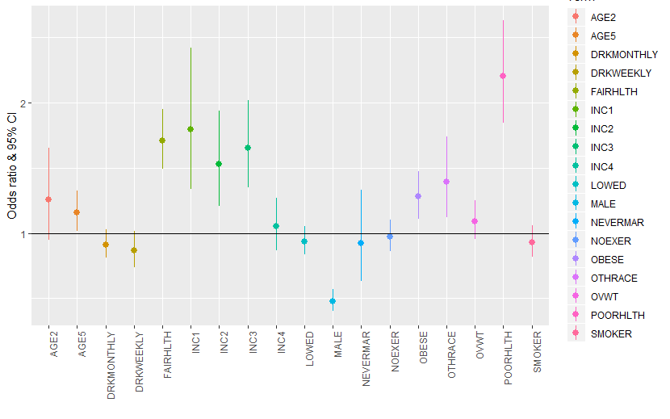

# BRFSS-Health-Descriptive-Analysis
In this repository, we explore the use of BRFSS dataset for descriptive analysis.

## Part I - Data Cleaning

You can find the xpt (SAS) data file and documentation for the data set [here](https://www.cdc.gov/brfss/smart/smart_2014.html).

## Part II - Descriptive Analysis

#### Frequency Summary Table:

#### Bivariate Analysis:

|  Independent Variable  |  Dependent Variable  |  Test  |
|  :---:  |  :---:  |  :---:  |
|  Categorical (ALCGRP)  |  Categorical (ASTHMA4)  |  Chi-squared or Fisher's exact test  |
|  Categorical (ALCGRP)  |  Continuous (SLEPTIM2)  |  Analysis of Variance (ANOVA)  |
|  Categorical with only 2 categories (SEX)  |  Continuous (SLEPTIM2)  |  Independent Group t-test  |
|  Continuous (Weight in pounds)  |  Continuous (SLEPTIM2)  |  Correlation  |

#### Chi-Square Test:

#### ANOVA Test:

#### Independent T test:

## Part III - Regression Analysis
The main object for performing a regression analysis on the data set is to explore the relationship between outcome variable and the explanatory variables in the study. In this repository, we demonstrate the use of **Linear Regression Model** and **Logistic Regression Model**. Generally speaking, linear regression is applied when the outcome variable is continuous and logistic regression is used when the outcome variable is a binary choice, such as Yes/No, Up/Down, True/False, etc.

#### Prepare for Linear Regression Analysis:
Before jumping into the regression model, we should examine the assumptions in linear regression model.  One common way to do it is use the visualize tools in the statistical package.  We can check the linear relationship between outcome variable and key variable of interest by plotting the data.
 
#### Feature Engineering:
Sometime,the data we have may not be sufficient to fit the model for various reasons. It's important to check and see if any modification or transformation is needed before fitting the data to the model. We deomonstrate the use of a few common transformation techniques in the example.
- Categorization and Transformation
- Indexes for Categorical Variable
- Quartiles Transformation
- Ranking the Continuous Variable

#### Choices of Modeling Approaches:
- Linear Regression: When dependent variable (outcome variable) is continuous
- Logistic Regression When dependent variable (outcome variable) is a binary choice.

#### Choosing the Correct Functional Form:
There are three main approaches to figure out the functional form of a regression model. We demonstrate the **forward stepwise regression** (or **forward selection**) in this example.

|  Atttribute  |  Forward Stepwise  |  Backward Stepwise |  Ambidirectional  |
|  :---:  |  :---:  |  :---:  |  :---:  |
|  Process  |  Run iterative models introducing a new variable each round  |  Start with all the variables in a model, an then run iterative models and remove variables each round  |  A custom combination of the two  |
|  Popularity  |  Not Popular  |  Extrememly Popular  |  A dirty Secret  |
|  Issues  |  At the end, try to put variable back inthat got kicked out  |  Start with all the variable all and the software can break due to small sells; also, no feel for data  |  Hard to explain in the methods section  |

#### Linear Regression Report:

|  Model 1: Base Model  |  Model 2: Adjusted for Age and Sex  |  Model 3: Fully Adjusted  |
|  :---:  |  :---:  |  :---:  |
|  Only includes exposure indicator variables. May be more than one with multilevel exposure.  |  Includes all covariates in Model 1, plus age and sex covariates.  |  Includes all covariates that survive the forward stepwise modeling process.  |

#### Logistic Regression Report:

